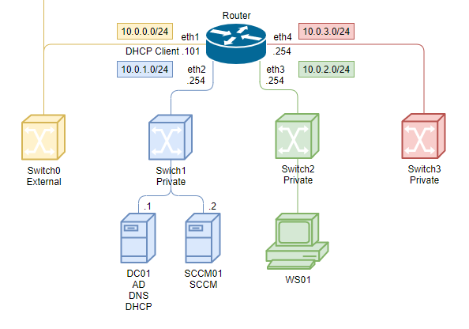
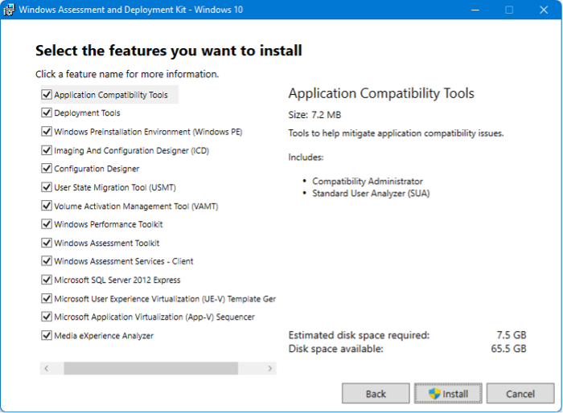
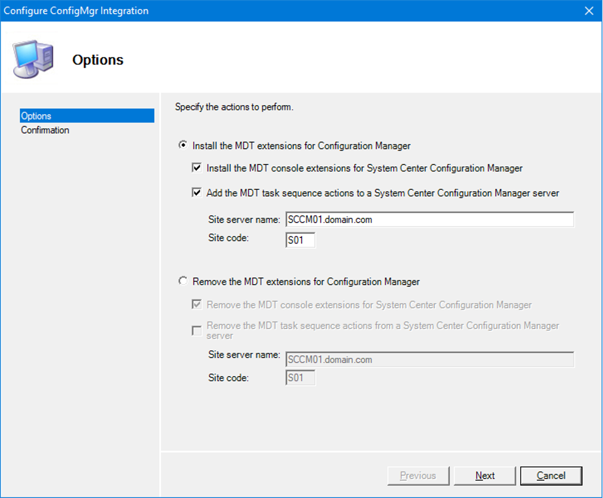
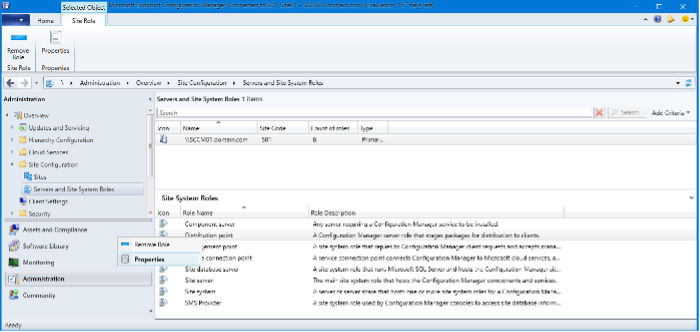
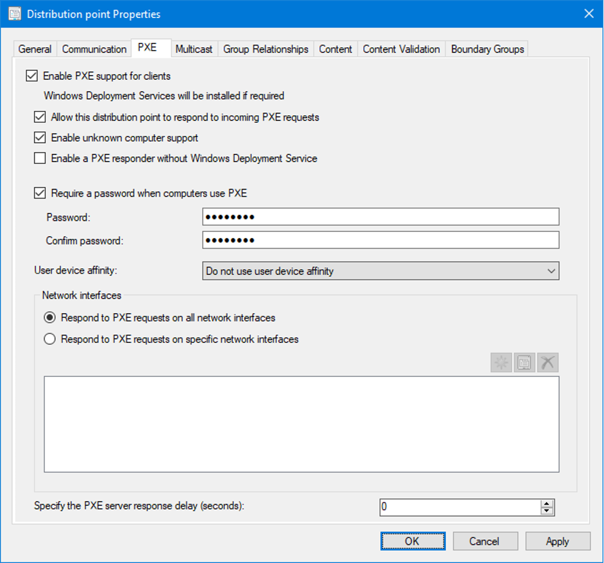
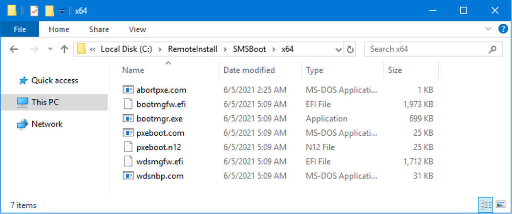
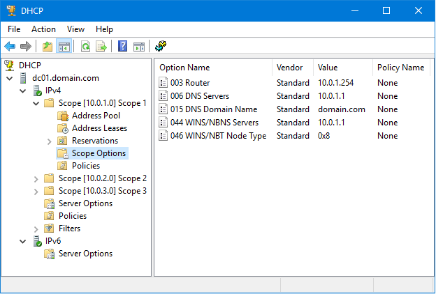
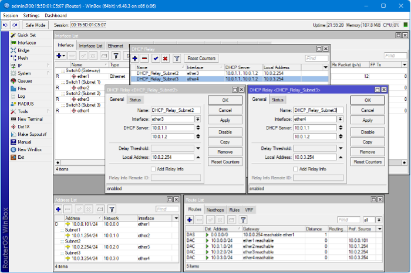

# Install PXE

## Install Windows ADK and Windows PE



To work with Windows images, the Windows Assessment and Deployment Kit and Windows Preinstallation Environment must be installed on the SCCM server. They are published on the official Microsoft website.

The installation files allow you to download and install without an internet connection.

Required components to install:

- Deployment Tools
- Windows Preinstallation Environment (Windows PE)



## Install and integration Microsoft Deployment Toolkit (MDT)

To extend the **Configuration Manager** console, install **MDT** with default settings on the SCCM server.

Launch the **Configure ConfigMgr Integration** application and perform the integration. Wizards and templates will be added.



## Enable PXE

To enable the **Preboot Execution Environment**, go to the properties of the **Distribution point**.



- **Enable PXE support for clients** - enables network boot functionality. Windows Deployment Services will be installed if the option "Enable a PXE responder without Windows Deployment Service" is not selected and if it is not already installed.
- **Allow this distribution point to respond to incoming PXE requests** – allows this distribution point to respond to PXE requests.
- **Enable unknown computer support** – respond to requests from machines not in the CM database. For example, a new computer that needs a corporate Windows image installed.
- **Enable a PXE responder without Windows Deployment Service** – enables the "ConfigMgr PXE Responder Service" to operate without the WDS role. Multicast will not be available. There will be no RemoteInstall folder.
- **Require a password when computers use PXE** – enables password prompt if you need to restrict user access to this feature. The prompt will occur after the Boot image loads but before the Task sequence is selected.



The **WDS** role will be enabled and the server will be ready to accept client requests. Completion can be confirmed from the log file `C:\Program Files\Microsoft Configuration Manager\Logs\distmgr.log`

Seven files will be created in each of the directories `C:\RemoteInstall\SMSBoot\x64` and `C:\RemoteInstall\SMSBoot\x86`. These are used by **WDS**, not **ConfigMgr PXE Responder**.



<table>
    <tr>
        <th></th>
        <th>x86 and x64 BIOS</th>
        <th>x64 UEFI and IA64 UEFI</th>
        <th></th>
    </tr>
    <tr>
        <td>Requires pressing F12 to continue PXE boot</td>
        <td>pxeboot.com</td>
        <td>bootmgfw.efi</td>
        <td>EFI version of PXEboot.com or PXEboot.n12 (in EFI, the choice between PXE boot is handled inside the EFI shell, not NBP). Bootmgfw.efi is the equivalent of combining the functionality of PXEboot.com, PXEboot.n12, abortpxe.com, and bootmgr.exe.</td>
    </tr>
    <tr>
        <td>Immediately starts PXE boot</td>
        <td>pxeboot.n12</td>
        <td></td>
        <td></td>
    </tr>
    <tr>
        <td>Allows the device to immediately begin booting using the next boot device specified in the BIOS. This allows devices that should not boot using PXE to immediately start the boot process without waiting for a timeout.</td>
        <td>abortpxe.com</td>
        <td></td>
        <td></td>
    </tr>
    <tr>
        <td></td>
        <td>bootmgr.exe</td>
        <td></td>
        <td></td>
    </tr>
    <tr>
        <td>Architecture detection. Pending device scenarios</td>
        <td>wdsnbp.com</td>
        <td>wdsmgfw.efi</td>
        <td>Handlers that prompt the user to press a key to continue PXE boot. Pending device scenarios</td>
    </tr>
</table>

- **bootmgfw.efi** – Windows boot manager for UEFI;
- **bootmgr.exe** – Windows boot manager for BIOS;
- **pxeboot.com** – Initiates the requirement to press F12 to start loading the image. This message is sent by the SCCM PXE server when a Task Sequence is deployed as Available;
- **pxeboot.n12** – Does not require pressing F12. This message is sent by the SCCM PXE server when a Task Sequence is deployed as Required. To use it, rename it to `pxeboot.com`;
- **wdsmgfw.efi** – NBP file for UEFI;
- **wdsnbp.com** – NBP file for BIOS.

### PXE Boot Scenario

1. The client is directed by the server to download **wdsnbp.com**;
2. **wdsnbp.com** checks the PXE reply packet and continues loading **pxeboot.com**;
3. **pxeboot.com** loads **bootmgr.exe** and the **Boot Configuration Data**. The **BCD** store must be located in the `\Boot` directory in the root TFTP folder;
4. **bootmgr.exe** reads the OS entries from **BCD**, loads **boot.sdi** and **winpe.wim**;
5. **bootmgr.exe** begins loading **Windows PE** by calling **winload.exe** inside the **winpe.wim** image.

## Enable role DHCP

PXE requires a running DHCP server. Configure three scopes for address assignment across different subnets: `10.0.1.101-200`, `10.0.2.101-200`, and `10.0.3.101-200`. Specify the gateway address and name server in each scope.



## Network settings

### Client Connection Scenario

1. The client computer sends a DHCP broadcast packet requesting addresses for the DHCP and PXE servers;
2. The DHCP server responds with a broadcast packet informing the client that it is an address server;
3. The PXE server responds to the client indicating that it is the boot server;
4. The client sends a request to the DHCP server for an IP address;
5. The DHCP server sends the IP address to the client;
6. The client sends a request to the PXE server for the path to the Network Boot Program (NBP);
7. The PXE server responds with the NBP path;
8. The client downloads and runs the NBP.

This works within a single subnet. For other subnets, client packets must be forwarded to the known DHCP and PXE server addresses.

For example, this is how it is done on MikroTik. The PXE server address `10.0.1.2` is also specified for DHCP.



For Cisco, use:

```bat
ip helper-address <ip DHCP server>
ip helper-address <ip WDS server>
ip forward-protocol udp 4011
```

What if DHCP options are used for this instead?

- Option 67 can only specify one parameter, so specifying a different image for other architectures or modes is not possible. The DHCP server cannot determine the architecture — BIOS or UEFI;
- After architecture detection and providing the appropriate image, PXE prompts to press F12 to continue. With a DHCP option, the machine will always boot from the network unless the feature is disabled in BIOS or UEFI;
- If you don't know the boot order configured on the organization's computers, don't worry — some machines will boot over the network without offering a choice;
- [Microsoft does not support the use of these options on a DHCP server to redirect PXE clients](https://docs.microsoft.com/en-US/troubleshoot/windows-server/networking/pxe-clients-not-start-dhcp-60-66-67-option);
- [Boot from a PXE server on a different network - Configuration Manager | Microsoft Docs](https://docs.microsoft.com/en-us/troubleshoot/mem/configmgr/boot-from-pxe-server).

## Additional components

### State migration point (SMP)

The state migration point is used to store user state migration data during computer replacement scenarios.

### Distribution point (DP)

The distribution point is used to store all packages in Configuration Manager, including packages related to operating system deployment.

### Software update point (SUP)

The software update point, which is typically used to deploy updates to existing machines, can also be used to update the operating system as part of the deployment process. Offline servicing can also be used to update the image directly on the Configuration Manager server.

### Reporting services point

The reporting services point can be used to monitor the operating system deployment process.

### Boot images

Boot images are Windows Preinstallation Environment (Windows PE) images used by Configuration Manager to initiate deployment.

### Operating system images

The operating system image package contains only one file — a custom WIM image. This is typically the production deployment image.

### Drivers

Like MDT Lite Touch, Configuration Manager also provides a repository (catalog) of drivers for managed devices.

### Task sequences

Task sequences in Configuration Manager look and feel like sequences in MDT Lite Touch and serve the same purpose. However, in Configuration Manager, a task sequence is delivered to clients as a policy through the management point (MP). MDT provides additional task sequence templates in Configuration Manager. The Windows Assessment and Deployment Kit (ADK) for Windows 10 is also required to support managing and deploying Windows 10.

## Create Boot image

When a client boots via PXE, CM provides a boot image selected based on the machine's architecture. If a boot image with the exact architecture is not available, CM uses an image with a compatible architecture.

### Boot Image Selection Scenario

1. CM finds the system record matching the MAC address or SMBIOS of the client attempting to boot.
2. CM determines the list of task sequences deployed for that client.
3. A boot image matching the client's architecture is selected from the task sequence list. If a boot image is found for that architecture, it is loaded. If multiple matching images are found, the one specified in the task sequence with the highest deployment identifier (created last) is used. If the hierarchy includes multiple sites, priority is assigned alphabetically (higher letters have higher priority). For example, ZZZ has priority over AAA regardless of deployment date.
4. If no boot image is found for the architecture, a compatible one is determined from the task sequence list found in step 2. For example, x64 clients with BIOS and MBR are compatible with both x32 and x64 images. x32 clients with BIOS and MBR are compatible only with x32 images. x64 UEFI clients are compatible only with x64 images, and x32 UEFI clients are compatible only with x32 images.

Go to the Boot image properties and check "Deploy this boot image from the PXE-enabled distribution point" to use the image for PXE.

## Problems

### Boot Image x86 for Windows 11 (x64)

For some reason, when creating a Boot Image, files are searched in `C:\Program Files (x86)\Windows Kits\10\Assessment and Deployment Kit\Windows Preinstallation Environment\x86`. This architecture is not supported by new Windows 11 images. You need to manually create this directory and copy the contents of the amd64 folder into it: `C:\Program Files (x86)\Windows Kits\10\Assessment and Deployment Kit\Windows Preinstallation Environment\amd64`

### VBSCRIPT in Windows PE 23H2

VBSCRIPT support was removed in Windows PE 23H2, but it is required for MDT Toolkit to work.

[Instructions for adding it](https://www.deploymentresearch.com/fixing-vbscript-support-in-windows-adk-sep-2023-update-build-25398/)

While installing this package on any Windows 10/11 machine, copy the packages (4 .cab files) from `C:\Windows\SoftwareDistribution\Download`.

For convenience, save them in an archive for future new images.

`Microsoft-Windows-VBSCRIPT-FoD-Package.zip`

Copy the packages to the directory `C:\Program Files (x86)\Windows Kits\10\Assessment and Deployment Kit\Windows Preinstallation Environment`.

Copy the en-us packages to `C:\Program Files (x86)\Windows Kits\10\Assessment and Deployment Kit\Windows Preinstallation Environment\amd64\WinPE_OCs`.

Copy the remaining packages to `C:\Program Files (x86)\Windows Kits\10\Assessment and Deployment Kit\Windows Preinstallation Environment\amd64\WinPE_OCs\en-us`.

Use MDT to generate a new Boot Image and in the creation wizard, check both packages to add them to the image.
