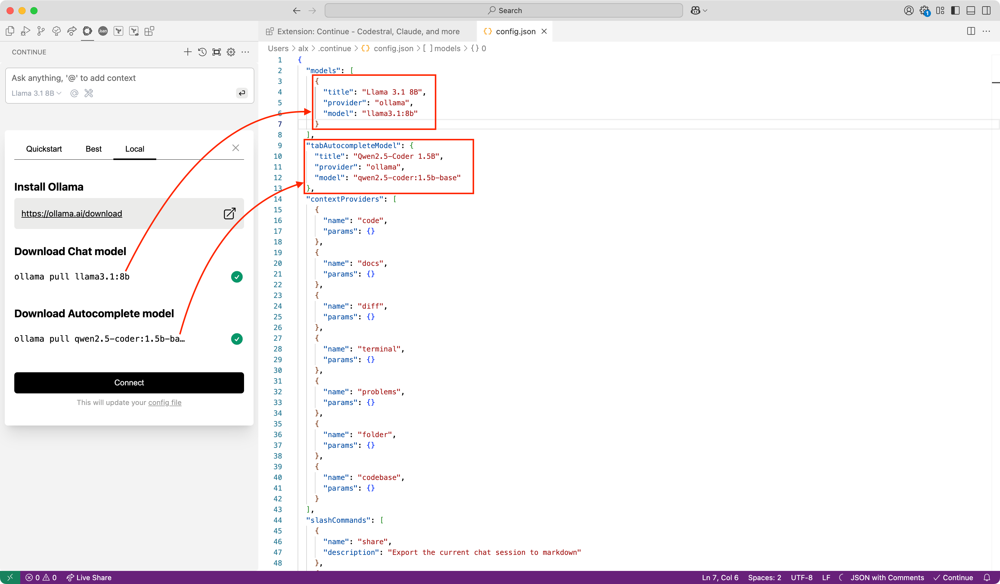

# Add LLM to VSCode

We will use the extension [Continue](https://continue.dev/) to add LLM to VSCode.

## Install extension from marketplace

Install extension for **VSCode** or **JetBrains** IDEs from the marketplace. For example, we will install for **VSCode**.

- [VSCode](https://marketplace.visualstudio.com/items?itemName=Continue.continue)
- [JetBrains](https://plugins.jetbrains.com/plugin/22707-continue)

After installation, you need install server for use models. For example, we will use these:

- [Install Ollama](../install-ollama/install-ollama.md)
- [Install LM Studio](../install-lm-studio/install-lm-studio.md)

:::tip

If you use **LM Studio**, don't forget to enable server mode:

:::

## Simple way to use LLM in VSCode

After install **Ollama** the simple way to use it is download models via plugin:

Click **Connect**:

Enjoy!

After that, you can start using LLM in VSCode. That's all!

## Add another model

Open config file:

Added models for Ollama shown here:

For chat you can add another model:

Use installed server:

You can choose direct model or use autodetect option:

Detected models shown here:

Example for LM Studio:

Usage example. You can how used memory when answer is generated:

