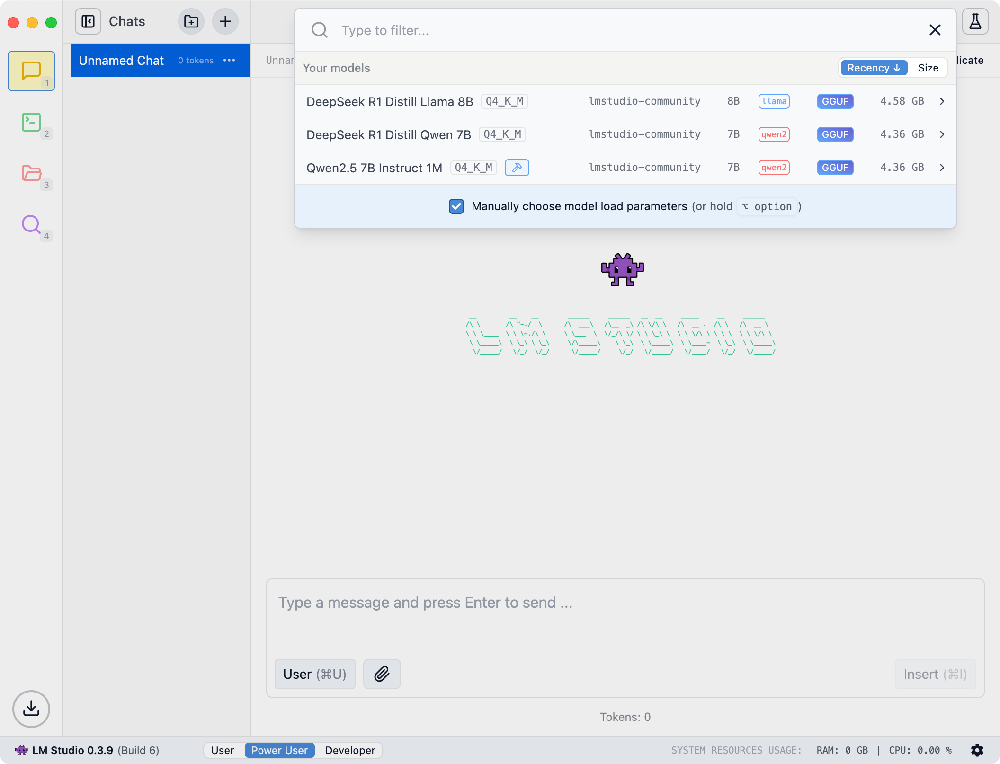
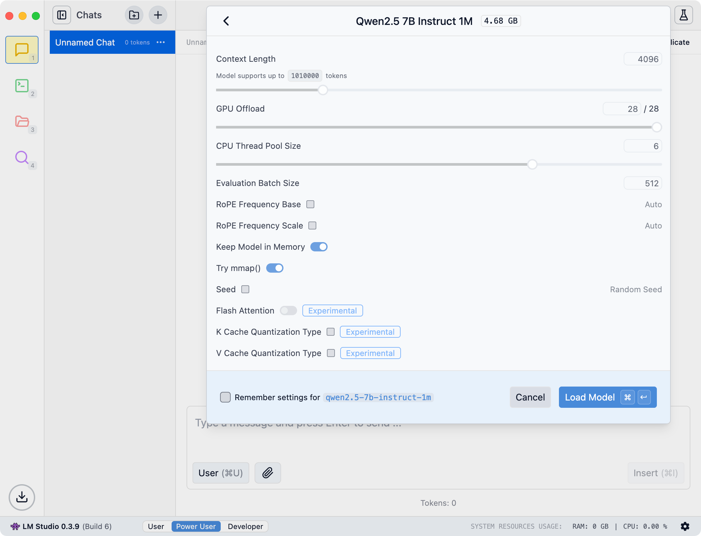
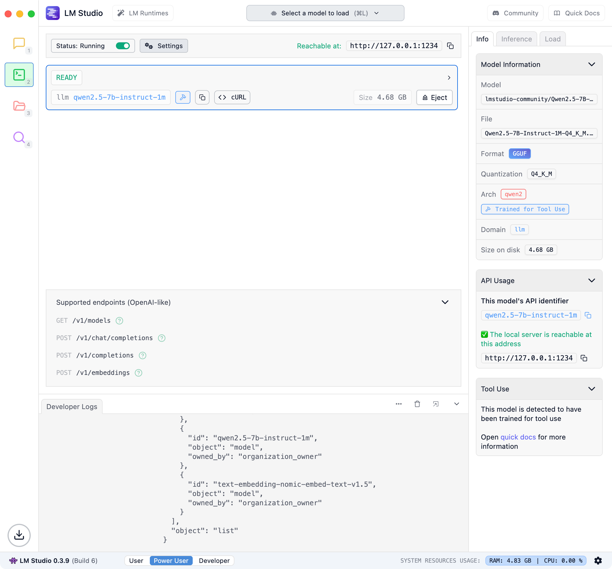
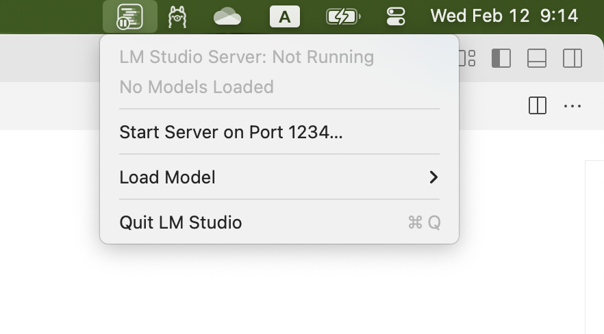
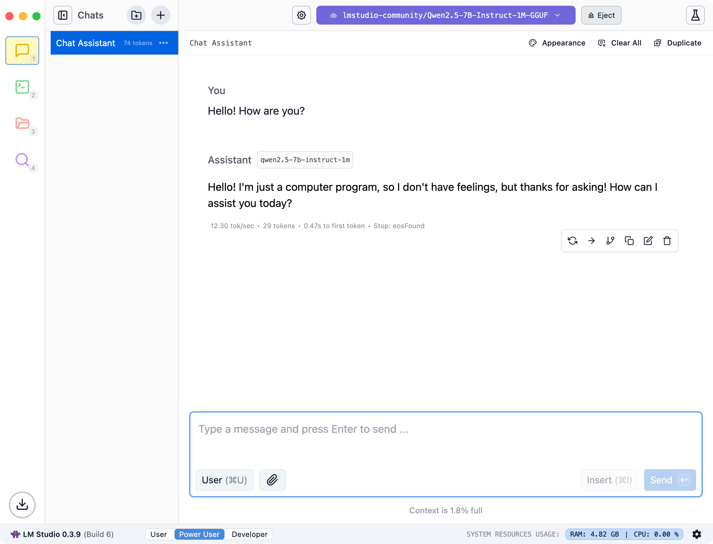
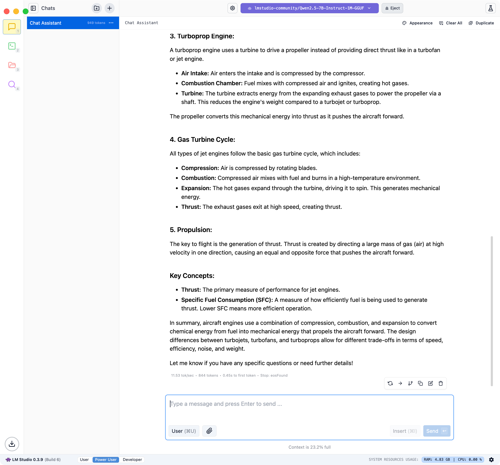

# Install LM Studio

You can download the latest version of [LM Studio](https://lmstudio.ai/). Application have GUI and you can use chat bot to interact with it.

## Download models

After install you need add model to your workspace. Got to **Discovery** and choose one:

Then you can load model at the top of the window:

## Server mode

For enable server mode you need go to **Developer** tab and switch on the checkbox. It need for use model in another applications.

Also you can enable it in tray menu.

## Example of usage

Try another models for best experience.
