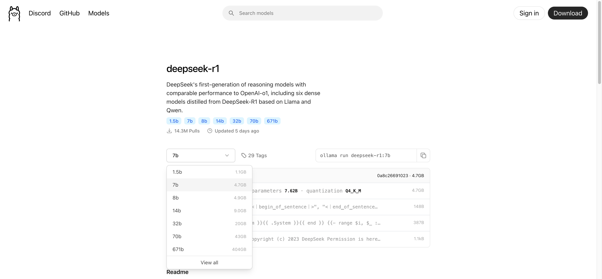
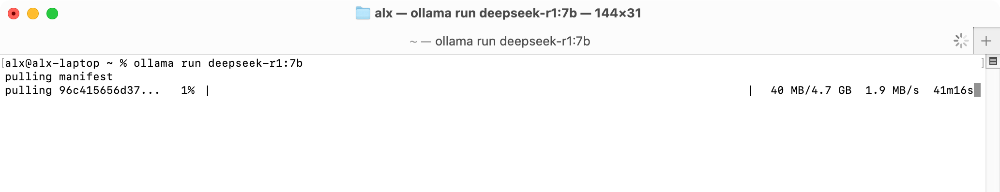

# Install Ollama

[Ollama](https://ollama.com) is tool for running large language models locally. [Download and install](https://ollama.com/download) app for your operating system. Also you can [download from GitHub](https://github.com/ollama/ollama/releases).

## Download models

After install in **Models** menu you can find commands for download models on you computer:

~5GB normal for 16GB operating memory. 14 billion parameters also ok but works slowly.

After install app you can use command `ollama` in your cli:

You can pull and run models from list:

Show all models on your computer:

## Example of usage

Start and try write prompt for example:

`How does an aircraft engine work?` is a really hard question. LM DeepSeek is a thinking model and writes how it thinks before giving an answer.

Also you can see how memory using in Activity monitor at start and in the end of work.

Finally:

